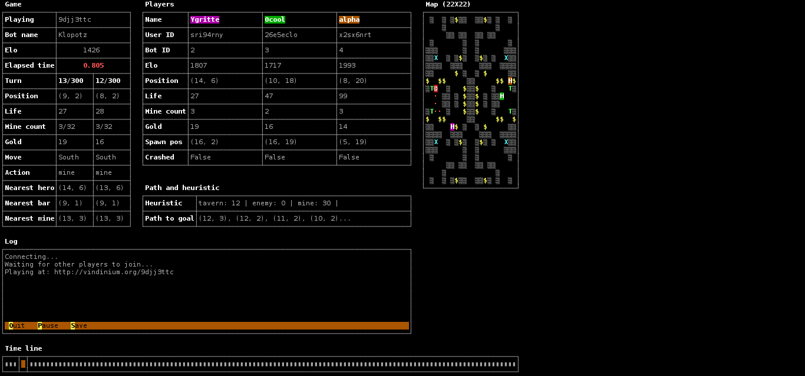

vindinium-curses_ui
===================

Python/Curses user interface for the Vindinium A.I contest.
http://www.vindinium.org/

1 - Licence:
------------
    This code is published by Doug Le Tough (doug.letough@free.fr) 
    and released under the W.T.F.P.L.
    
    It is based upon the Vindium python starter available here :
    https://github.com/ornicar/vindinium-starter-python
    
    A copy of the W.T.F.P.L is available in the LICENCE.txt file 
    that should accompany this source code.

    For further information about the WTFPL please
    visit  http://www.wtfpl.net/

2 - Content:
------------

 - ai.py                         The random A.I. This is where to put your A.I code
 - bot.py                        The bot object source code. Collects data processed.
 - CHANGELOG.TXT                 The changelog, you may read it.
 - client.py                     The client source code used to connect to game server
 - vindinium_curses_ui.png       A screenshots of the running U.I
 - vindinium_curses_ui_menu.png  Some screenshots of the setup menus
 - game.py                       Source code used to process data sent by the server
 - LICENCE.TXT                   A copy of the W.T.F.P.L
 - README.md                     This file
 - TODO.TXT                      The famous TODO list
 - ui.py                         The curses U.I. source code

3 - Prerequities:
-----------------

    a - An Unix-like system (Linux/BSD/MacOSX/...)
        Due to some limitations of the underlying operating system, 
        Windows is not not supported by this program.
        The work needed to make it work with Windows is not so
        hard but it is not a top priority for now.
        However, in a near future, this program should run over Windows.
        
    b - Python 2.7.x
        This Program will simply NOT run with Python3.
        
    c - The python-requests modules
    
    d - The python-curses modules

4 - How to make it work:
------------------------

    The ai.py file contains the code of your bot.
    With the bot.py file, it's merely the only file you'll need to play with.

    Many comments are dissiminated within the source code. 
    They shall help you to understand how to plug your A.I to the U.I.

    In order to make it work, you simply need to launch the client with 
    one of the following commands :
        
        a - python client.py <key> <[training|arena]> <number-of-games-to-play> [server-url]
        
            In this cas the starting setup menu will not be shown
            
            Examples:
            
            python client.py mySecretKey arena 10
            python client.py mySecretKey training 10 http://localhost:9000
            
        b - python client.py
        
            In this case the setup menu will be displayed and will ask you
            some basic infos to get connected to the server.

    Note : The code provided here do NOT contains any AI or path-finding code               
    but only a random AI. However it would run fine as is but would only win by mistake :)   

