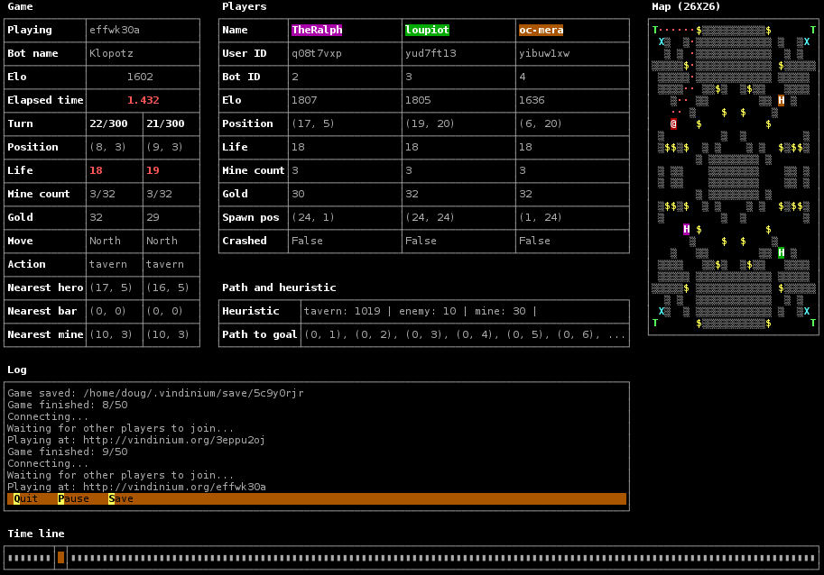
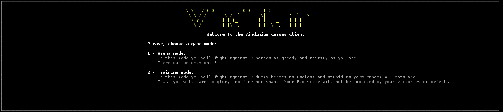

vindinium-curses_ui
===================

Python/Curses user interface for the Vindinium A.I contest.
http://www.vindinium.org/

1 - Licence:
------------
    This software is published and copyrighted by Doug Le Tough 
    (doug.letough@free.fr) and released under the W.T.F.P.L.
    
    It was initially based upon the Vindium python starter available here :
    https://github.com/ornicar/vindinium-starter-python
    
    A copy of the W.T.F.P.L is available in the LICENCE.txt file 
    that should accompany this source code.

    For further information about the WTFPL please
    visit  http://www.wtfpl.net/

2 - Content:
------------

    a - ai.py
        The random A.I. This is where to put your A.I code
        
    b - bot.py                        
        The bot object source code. Collects data processed.
        
    c - CHANGELOG.TXT
        The changelog, you may read it.
        
    d - client.py
        The client source code used to connect to game server
        
    e - vindinium_curses_ui.png
        A screenshots of the running U.I
        
    f - vindinium_curses_ui_menu.png
        Some screenshots of the setup menus
    
    g - game.py
        Source code used to process data sent by the server
    
    h - LICENCE.TXT
        A copy of the W.T.F.P.L
    
    i - README.md 
        This file
    
    j - TODO.TXT
        The famous TODO list
    
    k - ui.py
        The curses U.I. source code

3 - Goal:
-----------------

    The main goal of this project is to provide a solution to people 
    running their bots on a server and who'd like to view their 
    bots' activity in real-time without using the http connection 
    graciously provided by Vindinium.

    This U.I to Vindinium is usable in a terminal and using an ssh 
    connection also permits reducing network latency.
    
    It also provides a convenient way to save to and load configuration 
    and games from file allowing game later playback.

4 - Prerequities:
-----------------

    a - An Unix-like system (Linux/BSD/MacOSX/...)
        Due to some limitations of the underlying operating system, 
        Windows is not not supported by this program.
        The work needed to make it work with Windows is not so
        hard but it is not a top priority for now.
        However, in a near future, this program should run over Windows.
       
    b - A terminal or a terminal emulator such xterm able to display 
        colors and supports least a 48 lines X 150 columns resolution.
        This software will work nicely with terminal multiplexers like
        screen or tmux

    c - Python 2.7.x
        This Program will simply NOT run with Python3.
        
    d - The python-requests modules
    
    e - The python-curses modules

5 - How to make it work:
------------------------

    The ai.py file contains the code of your bot.
    With the bot.py file, it's merely the only file you'll need to play with.

    Many comments are dissiminated within the source code. 
    They shall help you to understand how to plug your A.I to the U.I.

    In order to make it work, you simply need to launch the client with 
    one of the following commands :
        
        a - python client.py <key> <[training|arena]> <number-of-games-to-play> [server-url]
        
            In this cas the starting setup menu will not be shown
            
            Examples:
            
            python client.py mySecretKey arena 10
            python client.py mySecretKey training 10 http://localhost:9000
            
        b - python client.py
        
            In this case the setup menu will be displayed and will ask you
            some basic infos to get connected to the server.

    You may post your question about this project to doug.letough@free.fr 
    or to the #vindinium freenode.net IRC channel. The latter may be a 
    faster way to obtain answers but an email should always be privileged 
    as it guaranties an first-hand answer.

6 - Note :
----------

    The code provided here do NOT contains any AI or path-finding code 
    but only a random AI (hey, This YOUR job to put it up). 
    
    However it would run fine as is but would only win by mistake :)   

